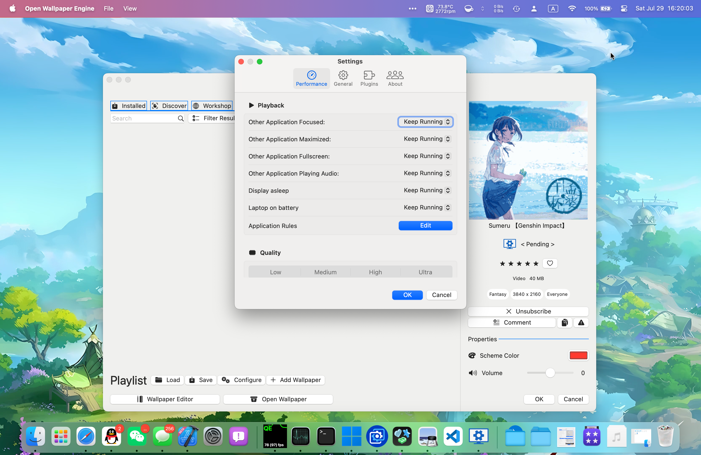
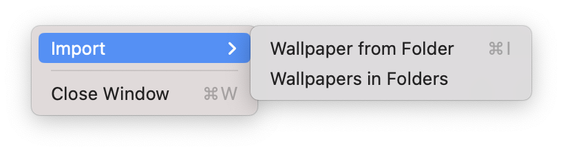
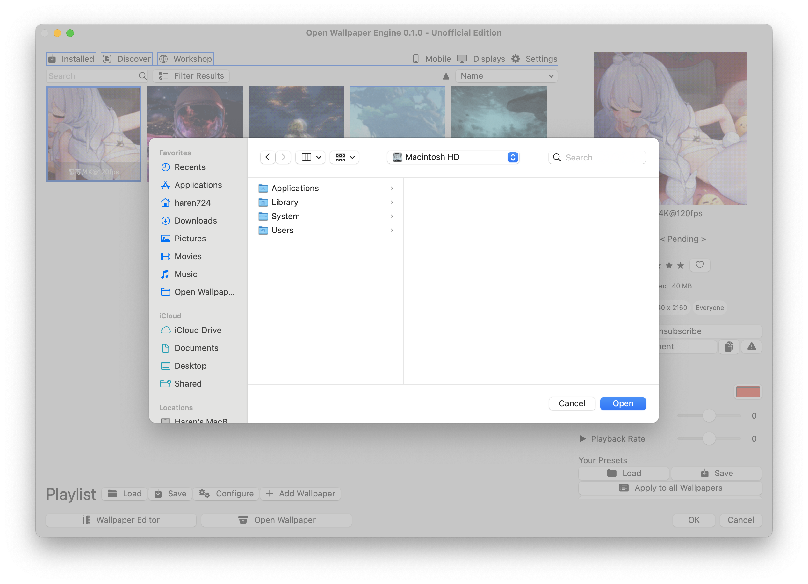
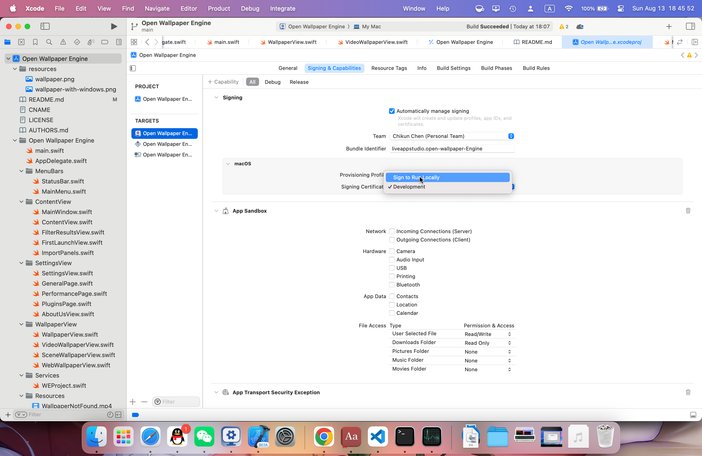

Open Wallpaper Engine
=========


An open source wallpaper engine for mac (which is not relative to the existing one on Steam)

<p align="center">
<a href="http://haren724.top/documentation/open_wallpaper_engine">Documentation</a>
·
<a href="https://github.com/haren724/open-wallpaper-engine-mac/blob/main/AUTHORS.md">Authors</a>
·
<a href="https://testflight.apple.com/join/9fDQc6dA">Testflight</a>
</p>

Menu
=================

<!--ts-->
- [Open Wallpaper Engine](#open-wallpaper-engine)
- [Menu](#menu)
  - [Presentation](#presentation)
    - [Wallpaper](#wallpaper)
    - [UI](#ui)
  - [Installation](#installation)
  - [Usage](#usage)
    - [Import from Wallpaper Engine (on Steam)](#import-from-wallpaper-engine-on-steam)
      - [Notice](#notice)
  - [Build](#build)
    - [Prerequisite](#prerequisite)
  - [Documentation](#documentation)
<!--te-->

## Presentation

### Wallpaper


### UI




## Installation
Download the .dmg file to local and drag the `.app` application file under `/Applications` folder

## Usage
Hi there!
I hosted a chat group on QQ: `228230228`  
Guys If you are interested in contributing to this project, please 
join this chat so that we could communicate much easier.

大家好呀！ 
我在QQ上建了个群：`228230228` 
如果您有兴趣为这个项目做出贡献，不介意的话加一下呗，以便我们可以更方便地沟通。

### Import from Wallpaper Engine (on Steam)

Check the File Menu



Then select **Folder** of your wallpaper to be imported



A normal wallpaper folder should like this (video wallpaper):
- wallpaper_folder_name
  - wallpaper_video_name.mp4
  - project.json
  - preview.gif

#### Notice
So far, only format from Wallpaper Engine is supported. That means you can't directly drag a `.mp4` file in and let it animate your desktop screen. We'll fix that soon.


## Build
If you would like to make contribute to this project or for some other purposes, then you probably should at least build once. Here're the steps:

### Prerequisite
- macOS >= 13.0
- Xcode >= 14.4
- Xcode Commandline Tools

-----
First, fork and clone your forked repo or just clone this repo directly if you don't plan to be a contributor. If you're in China, you'd better set up a HTTPS Proxy first to avoid failure due to bad connection or poor download speed.
```sh
git clone https://github.com/haren724/open-wallpaper-engine-mac
```

And then open the directory in Xcode.
```sh
open open-wallpaper-engine-mac -a /Applications/Xcode.app
```

Change Signine Certificate to your own or select 'Sign to Run Locally'



Then press `command ⌘ + R` to build and run


## Documentation
(newly update): a testing [DocC Documentation](http://haren724.top/documentation/open_wallpaper_engine) is currently on stage. Check it anytime if you need.

(old): This project's documentation can be build with `docc`. I'll upload the documentation link automatically built by github action here later.
